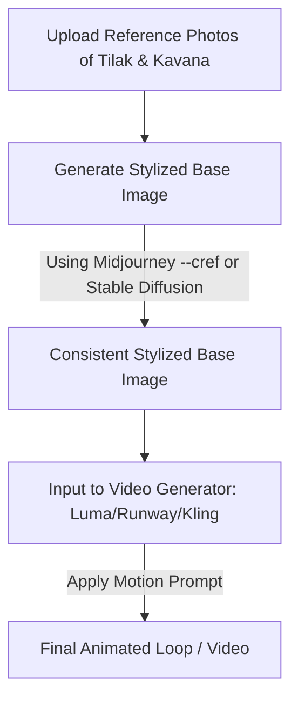

# Tilak & Kavana Wedding AI Video Prompt Guide

Creating a beautiful, looping, or short animated wedding video that maintains the **real facial features** of the bride and groom requires a specialized multi-step AI workflow. Modern Text-to-Video generators (like Google Veo, Runway Gen-3, Luma Dream Machine, or Kling AI) are incredible at motion, but they struggle to maintain precise facial consistency from text alone.

Here is the industry-best workflow to get stunning, consistent animated videos of **Tilak & Kavana** for your wedding website.

---

## The Master Workflow for Character Consistency

To ensure the animated characters look exactly like the reference photos you provide, use the **Image-to-Video (I2V)** method rather than just Text-to-Video:

### Step 1: Generate the Base Image (The "Stylized Keyframe")
Use an AI image generator that supports **Character/Face Reference** to create the initial wedding portrait in your chosen animation style.
*   **Midjourney v6/Niji 6 (Recommended):** Use the `--cref` (Character Reference) parameter. You upload the reference photos of Tilak and Kavana to a host (or directly in Discord), then structure your prompt like this:
    *   `[Prompt describing scene] --cref [URL_to_Tilak_Photo] [URL_to_Kavana_Photo] --cw 100 --niji 6`
    *   *Note on `--cw` (Character Weight):* Setting `--cw 100` copies the face, hair, and clothing style. Setting `--cw 0` focus only on copying the face structure while letting Midjourney generate new wedding outfits.
*   **Stable Diffusion (Automatic1111/ComfyUI):** Use **ControlNet InstantID** or **IP-Adapter-FaceID** to inject your faces into a Pixar, Disney, or 3D cartoon model.

### Step 2: Animate the Base Image (Image-to-Video)
Once you have the perfect base image of Tilak & Kavana in the animated style:
1.  Upload this image as the **First Frame** in **Kling 3.0**, **Luma Dream Machine**, or **Runway Gen-3 Alpha**.
2.  Write a **Motion Prompt** describing the movement, keeping the focus on subtle, high-quality, loopable actions (e.g., smiling, looking at each other, wind blowing, petals falling).
3.  Set the motion brush or camera controls to *slow panning* or *slow zoom* for a premium cinematic feel.

---

## Curated Prompt Templates for Indian Wedding Ceremonies

Below are detailed, production-ready prompt templates designed for traditional Indian ceremonies. They are structured for both **Pixar 3D Animation Style** and **Cinematic Stylized Anime Style**.

### 1. The Haldi Ceremony (Playful & Vibrant)
*   **Aesthetic:** Warm yellow tones, marigolds, playful splashes, bright daylight.
*   **Base Image Prompt (Midjourney / Niji / Imagen 3):**
    > `A Pixar-style 3D animated scene of a joyful Indian couple during their Haldi ceremony. The handsome groom (Tilak) and the beautiful bride (Kavana) are sitting close together, laughing. They are wearing matching bright mustard-yellow traditional clothing. Traces of yellow turmeric paste are playfully smeared on their cheeks. The background is a lush garden decorated with heavy drapes of orange and yellow marigold flowers, soft morning sunlight filtering through the trees. Vibrant colors, warm volumetric lighting, highly detailed fabric textures, octane render, 8k --niji 6`
*   **Animation Motion Prompt (Runway / Luma / Kling I2V):**
    > `Camera slowly zooms in. The couple turns their heads to look at each other, sharing a joyful, candid laugh. A soft breeze blows through the bride's hair, and a few marigold petals float gently across the screen. Ultra-smooth natural motion, high fidelity, 3D animated style.`

### 2. The Sangeet / Celebration Night (Magical & Dynamic)
*   **Aesthetic:** Twilight/night, fairy lights, rich jewel-toned clothing, bokeh, stars.
*   **Base Image Prompt (Midjourney / Niji / Imagen 3):**
    > `A beautiful Disney-style 3D animation of an Indian couple standing under a canopy of fairy lights at night. The groom is in a royal navy blue bandhgala sherwani with silver embroidery, and the bride is in a glittering emerald green lehenga. They are holding hands, looking at each other with warm smiles. The background is blurred with golden bokeh lights, starry night sky, and elegant floral arrangements. Magical, romantic atmosphere, rich colors, cinematic lighting, 3D cartoon style --cref --niji 6`
*   **Animation Motion Prompt (Runway / Luma / Kling I2V):**
    > `Slow-motion cinematic pan. The fairy lights twinkle softly in the background. The couple sways gently as if dancing to a slow melody. The camera slowly orbits them, maintaining focus on their smiling faces. High-end animation feel.`

### 3. The Varmala / Main Wedding (Grand & Divine)
*   **Aesthetic:** Royal mandap, red and cream attire, rose petals, sacred fire, grandeur.
*   **Base Image Prompt (Midjourney / Niji / Imagen 3):**
    > `A cinematic, highly detailed 3D animated masterpiece of an Indian wedding ceremony. The groom in a royal cream and gold sherwani and safa (turban), and the bride in a breathtaking crimson red Banarasi lehenga with intricate golden zari work, wearing heavy traditional gold jewelry. They have just exchanged beautiful red rose garlands (Varmala) and are looking at each other with deep affection. The background is a grand royal mandap decorated with red roses, white jasmines, and glowing oil lamps (diyas). Warm golden hour lighting, epic composition, Pixar-level detail, 8k`
*   **Animation Motion Prompt (Runway / Luma / Kling I2V):**
    > `Red and pink rose petals fall slowly from the top of the screen. The groom gently smiles, and the bride blushes and smiles. A warm glow from the mandap lights softly pulses. Extremely smooth, slow-motion tracking shot.`

### 4. The Website Intro / Invitation Scene (Elegant & Modern)
*   **Aesthetic:** Modern couple look, pastel colors (peach/pink), clean backdrop, perfect for website hero section.
*   **Base Image Prompt (Midjourney / Niji / Imagen 3):**
    > `Minimalist and elegant 3D stylized illustration of an Indian couple standing together against a clean pastel peach background. The groom is in a light peach kurta and the bride is in a matching floral mint green lehenga. They look happy and welcoming, gesturing toward the viewer. The styling is modern, clean 3D cartoon, soft clay render, studio lighting, smooth gradients, perfect for website banner`
*   **Animation Motion Prompt (Runway / Luma / Kling I2V):**
    > `Subtle breathing motion, the couple waves gracefully and smiles warmly at the camera. The background has a soft, slowly moving radial gradient. Perfect loop, smooth animation.`

---

## Pro-Tips for Generating the Best Website Video

1.  **Generate a Loop:** For a wedding website background, you want the video to loop seamlessly. In your motion prompt, append `perfect loop, seamless looping motion`. Kling and Luma both have settings/prompts that help generate seamless loops.
2.  **Keep it Short:** Limit the video length to 4–6 seconds. A longer video will take longer to load on a wedding website and is more likely to lose character consistency halfway through.
3.  **Optimize for Web:** Once generated, compress the MP4 video using a tool like Handbrake, or convert it to **WebM** format. WebM files are significantly smaller, load instantly, and support transparency if needed.
4.  **Use "Camera Movement Only" if Face Drifts:** If the AI starts distorting Tilak or Kavana's facial features during motion, decrease the motion setting and prompt the AI to only move the camera (e.g., `static couple, camera slowly pans left to right, wind gently blowing flowers`). This keeps the faces perfectly frozen in their stylized form while the environment moves dynamically.

---

## All-in-One Gemini Video Prompt (Single Video Generation)

If you are using **Gemini Video** (powered by Veo) directly by uploading your reference photos and running a single prompt, use the structured prompt below. 

### Instructions for Gemini:
1. Upload your reference photos of **Tilak** and **Kavana** to Gemini.
2. Paste the following prompt into the text box.

### The Prompt:
> **Style:** 3D Pixar/Disney animated film style, soft clay rendering, high-end production quality, warm and inviting aesthetic.
> 
> **Subject Reference:** Use the uploaded photo of the man as reference for the groom (Tilak), retaining his facial structure, hair style, and features. Use the uploaded photo of the woman as reference for the bride (Kavana), retaining her facial shape, smile, and features. Translate these real features into the 3D animated characters perfectly.
> 
> **Scene & Attire:** The groom is wearing an elegant cream-colored Sherwani with subtle gold embroidery. The bride is wearing a stunning crimson-red traditional Lehenga with intricate golden borders, paired with delicate bridal gold jewelry and a red sheer dupatta draped gracefully over her hair. They are standing close together, holding hands in front of a beautifully decorated Indian wedding mandap covered in yellow marigolds, white jasmine garlands, and warm twinkling fairy lights.
> 
> **Motion & Action:** A slow, cinematic panning camera shot around the couple. They look at each other, share a warm, loving smile, and then turn to look forward at the camera. A soft breeze gently blows through the bride's dupatta and hair. Small rose petals float down slowly from above in a dreamlike manner.
> 
> **Lighting & Quality:** Warm golden hour sunset lighting, soft shadows, cinematic depth of field with a beautiful background bokeh. 4k resolution, hyper-detailed textures on the clothing, photorealistic fabric, 3D animated movie trailer quality, smooth loopable motion.

